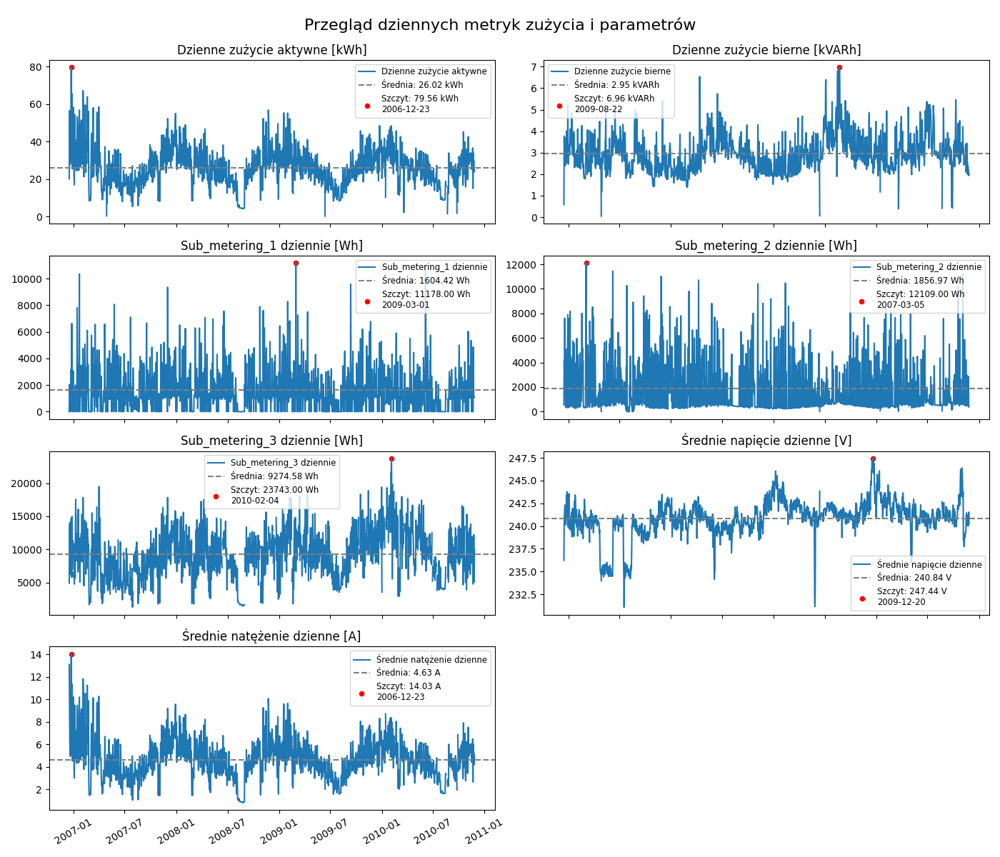
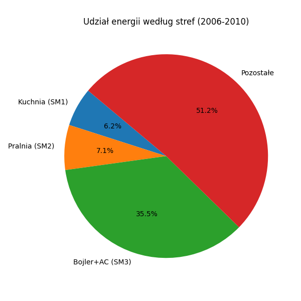
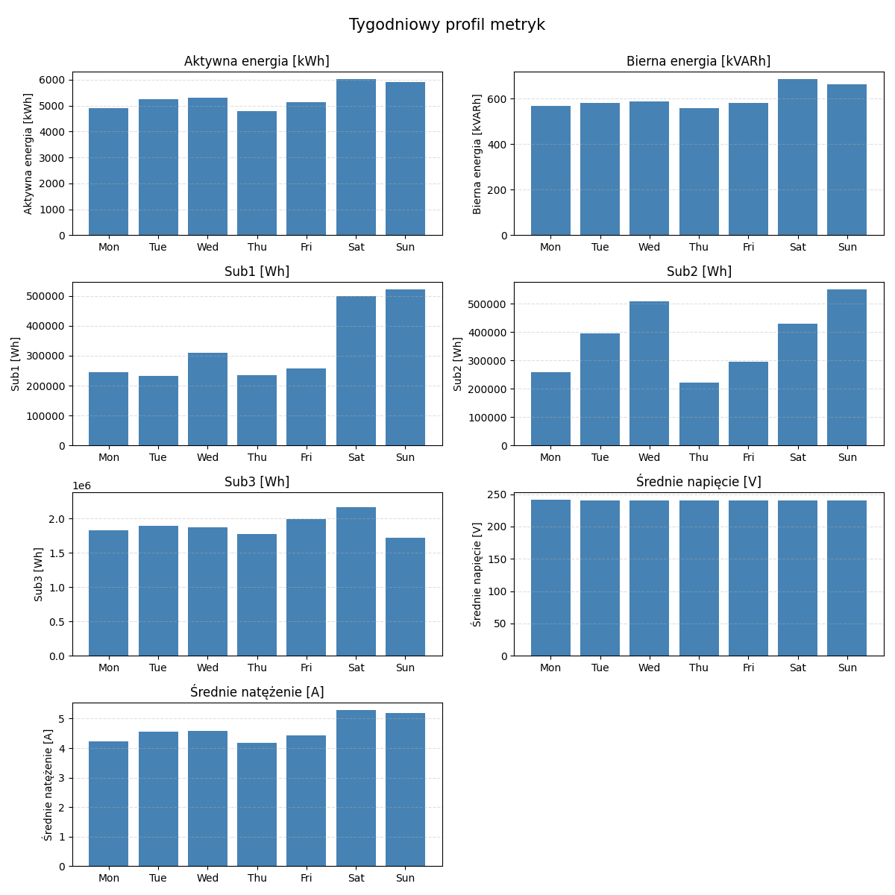
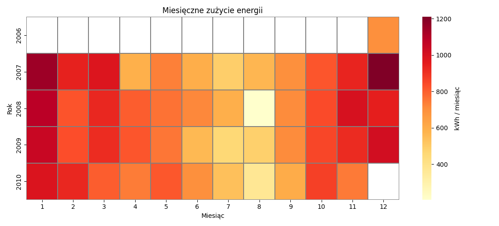
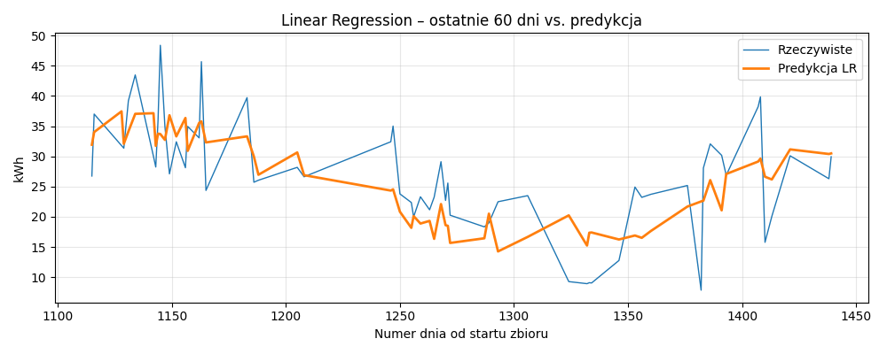

* **Źródło:** UCI – *Individual Household Electric Power Consumption*.  
* **Zakres czasu:** **16 XII 2006 – 26 XI 2010** (47 miesięcy).  
* **Częstotliwość próbkowania:** **co 1 minutę** → 2 075 259 obserwacji.  
* **Lokalizacja instalacji:** dom jednorodzinny w Sceaux, ok. 7 km od Paryża (Francja).

| Kolumna                | Typ          | Opis                                                               |
|------------------------|--------------|--------------------------------------------------------------------|
| `Date`                 | kategoria    | data w formacie **dd/mm/yyyy**                                     |
| `Time`                 | kategoria    | czas w formacie **HH:MM:SS**                                       |
| `Global_active_power`  | ciągła       | moc czynna *uśredniona minutowo* \[kW\]                            |
| `Global_reactive_power`| ciągła       | moc bierna *uśredniona minutowo* \[kVAR\]                          |
| `Voltage`              | ciągła       | napięcie sieci *uśrednione minutowo* \[V\]                         |
| `Global_intensity`     | ciągła       | prąd (natężenie) *uśredniony minutowo* \[A\]                       |
| `Sub_metering_1`       | ciągła       | energia w kuchni (zmywarka, piekarnik, mikrofalówka) \[Wh/min\]    |
| `Sub_metering_2`       | ciągła       | energia w pralni (pralka, suszarka, lodówka, oświetlenie) \[Wh/min\]|
| `Sub_metering_3`       | ciągła       | energia bojlera i klimatyzacji \[Wh/min\]   

#### Wykresy trendów, średnich i wartości szczytowych:

#### Procentowy udział energii według stref:

Pozostałe = Energia czynna - Sub_metering_1 -Sub_metering_2 - Sub_metering_3

### Stabilność i wahania pomiarów minutowych

| Metryka                | Średnia (µ) | Wariancja (σ²) | CV = σ / µ |
|------------------------|------------:|---------------:|-----------:|
| Global_active_power    | **1.092** kW | 1.118 | 0.969 |
| Global_reactive_power  | 0.124 kVAR | 0.013 | 0.911 |
| Voltage                | 240.840 V | 10.498 | 0.013 |
| Global_intensity       | 4.628 A | 19.753 | 0.960 |
| Sub_metering_1         | 1.122 Wh | 37.860 | **5.484** |
| Sub_metering_2         | 1.299 Wh | 33.896 | 4.484 |
| Sub_metering_3         | 6.458 Wh | 71.186 | 1.306 |

Wnioski:  
* Napięcie ma **najmniejsze CV (0.013)** – praktycznie stałe.  
* Najbardziej odstające są pomiary Sub_metering 1 / 2 (CV > 4), co potwierdza, że podłączone urządzenia włączają się punktowo (np. zmywarka, pralka).  
* Całkowita moc czynna ma CV ≈ 1 – umiarkowana zmienność wpisująca się w cykl dobowy.  

#### Znormalizowane rozkłady godzinowe metryk
Aby porównać różne metryki na jednej skali, każdą z nich znormalizowano metodą min–max:

  

gdzie:  
- <code>h</code> to godzina dnia (0–23),  
- <code>valueh</code> to agregowana wartość metryki w godzinie <code>h</code>,  
- <code>minh′(…)</code> i <code>maxh′(…)</code> to odpowiednio najniższa i najwyższa wartość tej metryki spośród wszystkich godzin.

Wspólny wykres pozwala zobaczyć o której godzinie osiąga się szczyt danej miary, porównać kształty i rozkłady godzinowe różnych wielkości niezależnie od ich jednostek.

#### Wykresy zużyć tygodniowych
Poniższy wykres grupuje dane według dni tygodnia (pon.–niedz.):

* **kWh / kVARh** – suma dobowych energii czynnej i biernej  
* **Sub 1-3 [Wh]** – łączna energia z trzech pod-liczników  
* **V / A** – średnie dzienne napięcie oraz natężenie

Wartości energii zostały przeliczone na Wh lub kWh, a napięcie i natężenie
pokazane jako średnia arytmetyczna. Dzięki temu łatwo widać,
który dzień tygodnia generuje najwyższe (lub najniższe) obciążenie.

#### Heat mapa zużycia energii aktywnej

#### Model LR dla zużycia aktywnego
* **Trend czasowy** – kolejny numer dnia (`t_idx`), łapie długofalowe zmiany.  
* **Sezon roczny** – `sin(dzień-roku)` i `cos(dzień-roku)` rozróżniają lato / zimę.  
* **Dzień tygodnia** – siedem flag (pn…nd) wskazujących konkretny dzień.

Razem 10 bardzo cech.

**Parametry treningu**

| element | wartość |
|---------|---------|
| Próbka  | grudzień 2006 → listopad 2010 (1 276 dni) |
| Podział | 80 % train / 20 % test |
| Model   | `LinearRegression` – Spark MLlib, `maxIter=50`, `regParam=0` |

\
Efekt:

| Metryka | Wartość |
|---------|---------|
| RMSE | **7.35 kWh** |
| R²   | **0.409** |

